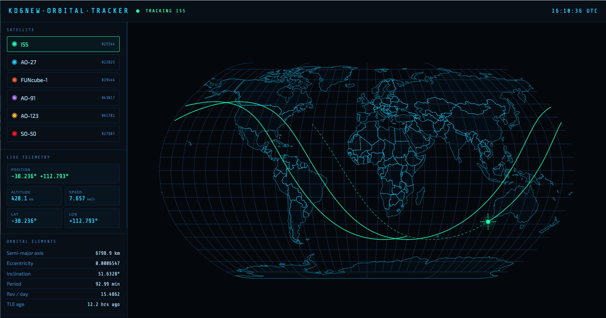

-----------------------------------------------
# Satellite Tracking Program
## Built by Vibe Coding using Anthropic Claude AI
#### Created by glydeck 4/17/2026
-----------------------------------------------
### Screen Shot
 

### Introduction
This satellite tracker was Vibe Coded using **Anthropic Claude AI** strictly as an experiment. The results were so good that I'm using and sharing it with fellow amateur radio operaters to get current information on the location of some of the more popular satellites. The original page created by **Claude** did have some short falls that we're easily corrected.

- The Keplarian elements retrieved by Claude were very out of date.
- The preview of the ground track was only 45 minutes.
- Colors for the map & some fonts were dim and hard to see.

### Example:
- [**See it Work**](http://glydeck.com/satellite_tracker.html)

### Requirements
To use the **satellite_tracker.html** the only requirements is an Internet web browser. To use the Jupyter Notebook version of the updater requires running an instance of **Jupyter Lab (https://jupyter.org/)**. The stand alone python version of the updater requires Python 3. Both the Jupyter Lab version and Python 3 version will require that the **"requests"** module be installed.

### Contents 
      readme.md                    --This File
      satellite_tracker.html       --Sample Satellite tracking WEB page
      updateSatelliteTracker.ipynb --Jupyter note book
      updateSatelliteTracker.py    --Stand alone python file
      file1.txt                    --File used to build WEB page
      file2.txt                    --File used to build WEB page

### Python Script to update elements
The Python code used here was developed with **Jupyter Lab** as a notebook file. After successful testing of the Jupyter Lab notebook a single Python file was created that could be used independently. Both the notebook and python files retrieve the most current amateur satellite Keplerian elements from **celestrak.org**. 

### Usage
When updating the the html file with fresh Keplerian elements it is only necessary to have the following three files in a folder.

#### For Jupyter Lab:
- updateSatelliteTracker.ipynb
- file1.txt
- file2.txt

#### For Python:
- updateSatelliteTracker.py
- file1.txt
- file2.txt

When either the notebook or python versions are run three addtional files will be created:
- keplerian.txt
- file2.txt
- satellite_tracker.html
 
### Changing, Adding or Removing Satellites
Changing the satelites in the web page requires editing the javascript array **SATS =** in file1.txt. This array is at the end of the file starting at line 212.  To change a satellite update **name:** with the name of the satellite and **id:** with the NORAD number of the satellite. The **color:** will be the hexidecimal color of the ground track.
```
const SATS = [
  { name:'ISS',       id:25544, color:'#00ffaa' },
  { name:'AO-27',     id:22825, color:'#00cfff' },
  { name:'FUNcube-1', id:39444, color:'#ff6b35' },
  { name:'AO-91',     id:43017, color:'#c084fc' },
  { name:'AO-123',    id:61781, color:'#fbbf24' },
  { name:'SO-50',     id:27607, color:'#fb2222' },
];
```
Next, the notebook or python code needs to be updated with the new NORAD numbers. The NORAD number appears in two search strings and the print to file statement. Adding a satellite requires adding the satellite to the array and duplicating and adding the block of code in the python program.
```
#Satellite 01
search_string_01 = "1 25544"
search_string_02 = "2 25544"
# Find & write Keplarian Data for Satellite 01
with open("kepelements.txt", "r") as file, open('file2.txt', 'a') as target_file:
    for line_01 in file:
        if search_string_01 in line_01:
            print(f"   25544:['{line_01.strip()}',\n", file=target_file, end='')
#file.close()  # Must be called explicitly
with open("kepelements.txt", "r") as file, open('file2.txt', 'a') as target_file:
    for line_02 in file:
        if search_string_02 in line_02:
            print(f"          '{line_02.strip()}'],\n", file=target_file, end='')
```


## External Dependicies

The satellite tracking page uses three links to external javascript libraries. The URLs for these javascript libraries can be found in lines 7, 8 & 9 of **file1.txt**. To render the page locally you will need to download a copy of each of these libraries and link to them locally.

- **javascript libraries:**
  - **D3** JavaScript library for data visualization
  - https://d3js.org/
  - **TopoJSON** for making the map. 
  - https://github.com/topojson/topojson
  - **Satellite.js** - A library to make satellite propagation via TLEs possible on the web.
  - https://github.com/shashwatak/satellite-js 

The link to a forth Dependicie is an external CSS file with links to **WOFF2** fonts used in the web page. The link to this CSS file is on line 10 of **file1.txt** WOFF2 (Web Open Font Format 2.0) is a highly compressed font format used in web pages.

- **Link to the Stylesheet:**
  - 'https://fonts.googleapis.com/css2?family=Share+Tech+Mono&family=Exo+2:wght@300;400;600&display=swap"rel="stylesheet'
